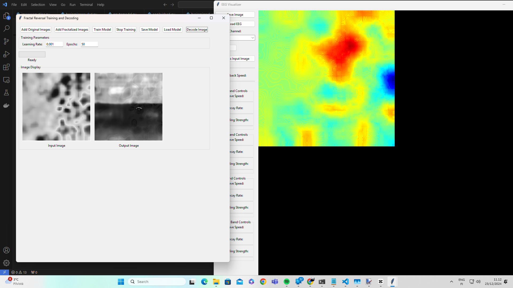

# EDF-EEG-FractalVisualizer

EDIT: 
Yes, the code makes similar structures out of the temp channel etc too. So the code produces a  lot of the fractal likeness. But the fractals are more complex with eeg data.

Claude Pointed out: 

These create fractal-like patterns for any input, but:

With temperature: Shows basic wave dynamics
With EEG: Reveals complex frequency interactions


Key Differences:


Temperature channel shows smoother gradients
Activity channel shows more structured boundaries
EEG shows rapid pattern formation/dissolution




Real-time EEG visualization tool that displays brain wave frequency bands as dynamic wave patterns.

## Installation

Install dependencies:
```bash
pip install numpy pillow mne scipy opencv-python etc. 
```

## Usage

1. Run the script:
```bash
python eeg_visualizer.py
```

2. Click "Load EEG" to select an EEF file. Wait a while until channel selection becomes available. 
3. Select a channel from the dropdown
4. Use the Play/Pause button to control visualization
5. Adjust sliders to control wave behavior for each frequency band

# What causes the pulse and topology? 

Claude: 


Topological Features:
These emerge from several factors in your code:

Wave pattern generation

radial_wave = np.sin(self.distance - self.phase) * np.exp(-self.distance * 0.15)
spiral_wave = np.sin(self.distance + self.angle - self.phase) * np.exp(-self.distance * 0.1)

The topological map-like features come from:

The interaction between radial and spiral waves
The exponential decay terms (exp(-self.distance))
The cross-frequency coupling between layers


Pulse-like Behavior:

What looks like pulsing comes from:

Natural decay and momentum

self.state *= (1 - self.decay_rate * dt)
self.momentum = 0.95 * self.momentum + 0.05 * (wave - self.state)

This creates a kind of oscillatory behavior where:

The state naturally decays

New input creates momentum

The momentum carries through to create pulse-like effects
